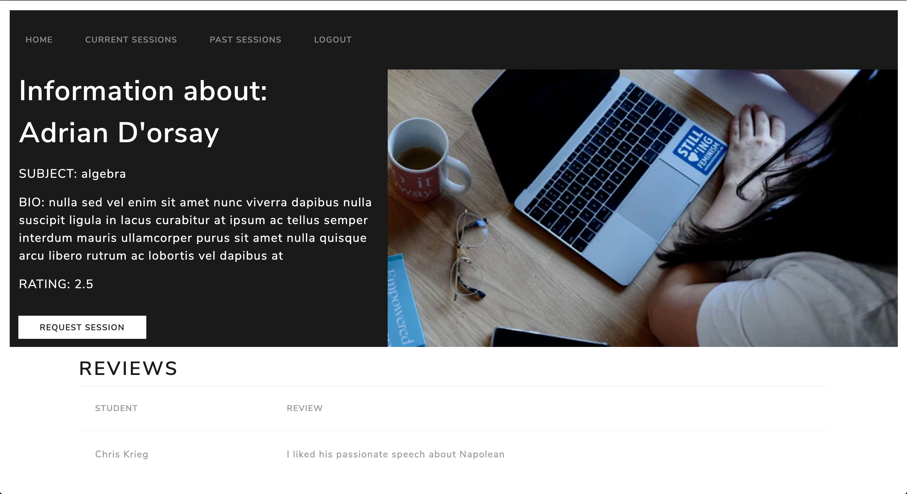
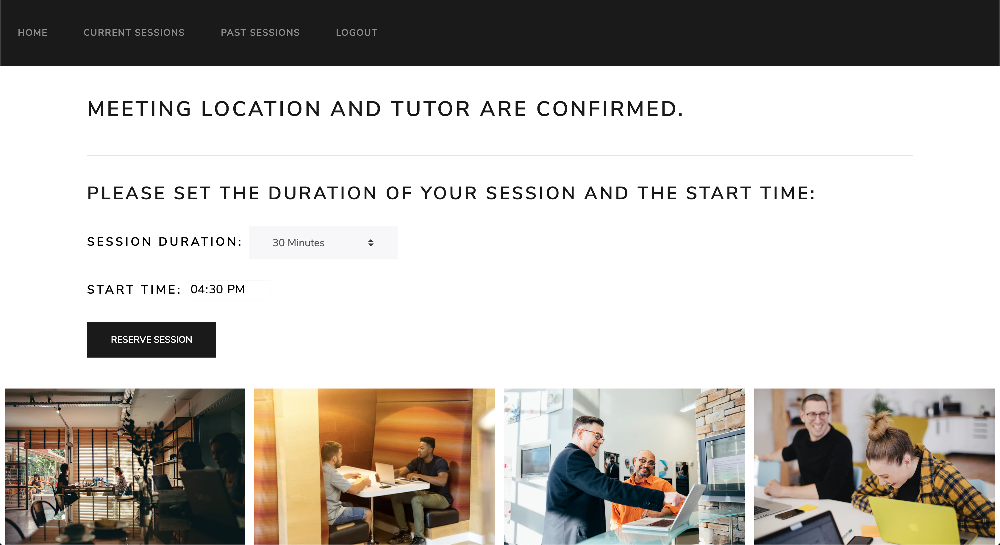
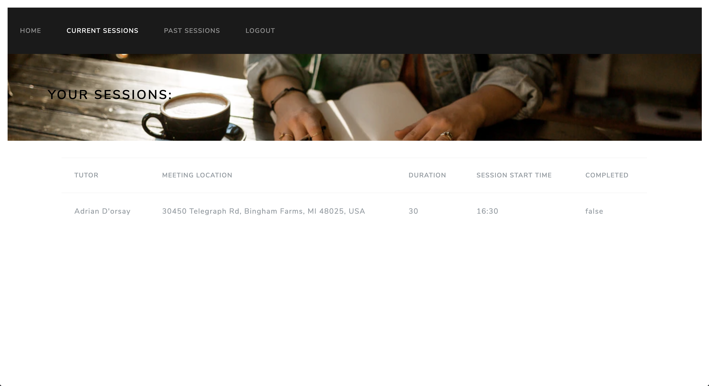
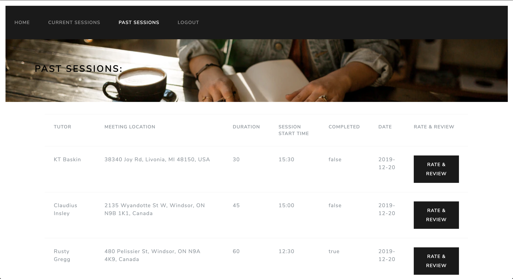
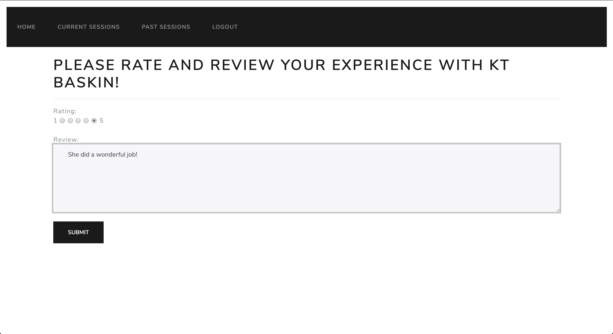
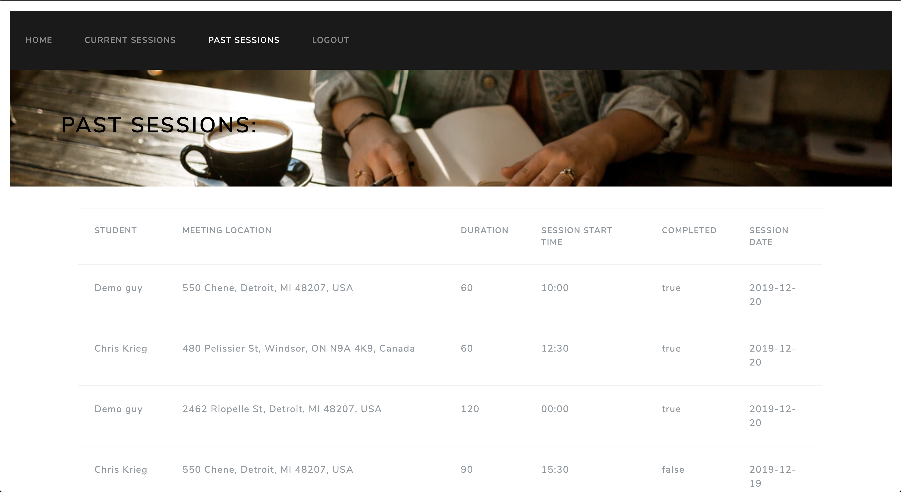

# ReadyTutorOne

### Purpose

ReadyTutorOne is a web application that I and three other students from Grand Circus collaborated on for our final group project. 
The concept came from when I was teaching English in Japan and I was tight for money. 
I wanted to create an app that allowed me to login as a tutor and other “student” users can see my location on a map and request a quick 30-60 min English lesson. 
Think Uber, but for English teachers.

A tutor or student can register an account, which would be saved to a database.

Once registered, a user can sign in.

Once the student logs into the application, it displays their current location on a map, using Google Map’s Geolocation API, and it shows the other tutors in the surrounding area.

A student can filter by subject and refresh the map.

Using the Google Maps API, we were able to customize info-windows, which are displayed when the user hovers their mouse over a tutor.

If the user wants to know more information about the tutor, clicking the "See Details" button takes them to this page.
You are able to see the reviews that other students gave this tutor.

Once the tutor is selected, a map with a radius marks the center point between the tutor and student.
A student can specify what type of location they want the session to take place at. 

After hitting submit, the map refreshes and displays all the businesses in the search radius.
A user can hover over each marker and see the business details. 
Clicking on the link will direct the user to that business' Yelp page

After selecting the business, the user is taken to the session registration page, where they indicate the start time and duration.

This page is displayed after hitting "Reserve Session"

Only the current sessions for that day is displayed in the "Current Sessions" tab.

Once that day has past, the session is moved over to "Past Sessions" where the user can rate and review the tutor.

A tutor is rated on a 5 point scale. 
After hitting submit, the old rating is averaged with the new rating, and the tutor rating is then updated.

This is the tutor home page.

A tutor can view their current sessions here.
A tutor can also mark their sessions as complete.

The tutor's past sessions are displayed in this tab.
